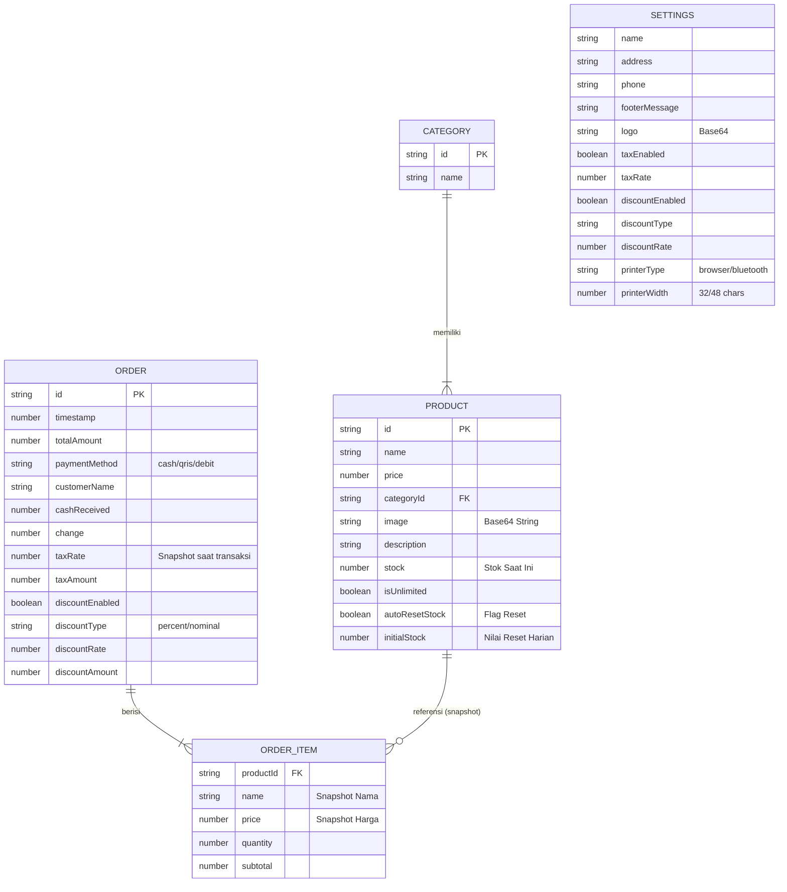

# Arsitektur Sistem & Struktur Data

## 1. Tech Stack
*   **Frontend Framework:** React 18 (TypeScript)
*   **State Management:** React Hooks (`useState`, `useEffect`, `useMemo`) + Prop Drilling (Sederhana & Efektif).
*   **Styling:** Tailwind CSS (Utility-first CSS).
*   **Penyimpanan Data:** Browser LocalStorage (JSON Persistence).
*   **Hardware Interface:** Web Bluetooth API (untuk komunikasi Thermal Printer).
*   **Libraries Pendukung:**
    *   `lucide-react`: Ikon UI.
    *   `recharts`: Visualisasi Grafik.
    *   `xlsx`: Export laporan ke Excel.

## 2. Entity Relationship Diagram (ERD)

Meskipun menggunakan penyimpanan NoSQL (JSON), struktur data dirancang secara relasional untuk menjaga integritas data.



## 3. Desain Sistem (Architecture)

Aplikasi menggunakan arsitektur **Client-Side Monolith** dengan pola **Service-Repository** untuk pemisahan logika penyimpanan.

```mermaid
graph TD
    User[User / Kasir] -->|Interaksi UI| UI[React Components]
    
    subgraph Frontend Application
        UI -->|State Management| AppState[App.tsx (Global State)]
        
        AppState -->|Persistensi Data| StorageService[services/storageService.ts]
        AppState -->|Cetak Struk| PrinterService[services/printerService.ts]
        
        StorageService -->|Read/Write JSON| LocalStorage[(Browser LocalStorage)]
        
        PrinterService -->|Cek Tipe| PrinterLogic{Tipe Printer?}
        PrinterLogic -->|Browser| WindowPrint[window.print API]
        PrinterLogic -->|Bluetooth| WebBLE[Web Bluetooth API]
    end
    
    WebBLE -->|ESC/POS Commands| ThermalPrinter[Hardware Printer Bluetooth]
```
