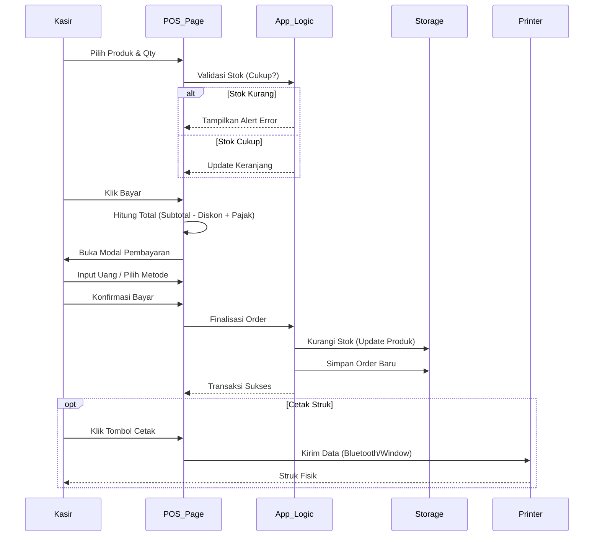
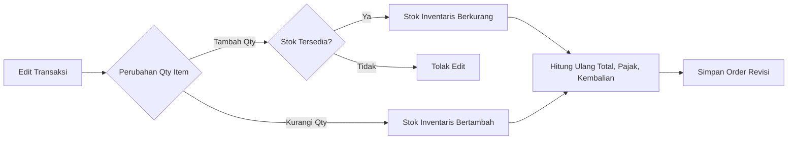

# Alur Program (Program Flow)

Berikut adalah visualisasi alur kerja utama dalam aplikasi KafeKita POS.

## 1. Alur Transaksi (Checkout)

Proses dari pemilihan barang hingga pencetakan struk.



## 2. Alur Reset Stok Harian

Fitur ini digunakan untuk mengembalikan stok produk harian (seperti kue basah/roti) ke jumlah awal sebelum toko buka.

```mermaid
flowchart TD
    Start([Mulai Shift Pagi]) --> Login{Login Admin}
    Login -- Gagal --> Login
    Login -- Sukses --> Dashboard
    
    Dashboard --> Settings[Menu Pengaturan]
    Settings --> ResetSection[Bagian Operasional Stok]
    
    ResetSection --> ClickReset[Klik "Reset Stok"]
    
    ClickReset --> CheckProducts{Ada Produk Terkonfigurasi?}
    
    CheckProducts -- Tidak Ada (0) --> AlertError[Alert: Belum ada produk diset]
    AlertError --> End([Selesai])
    
    CheckProducts -- Ada (>0) --> Confirm[Modal Konfirmasi]
    
    Confirm -- Batal --> End
    Confirm -- Ya, Reset --> ProcessLoop[Looping Produk]
    
    subgraph Logika Sistem
        ProcessLoop --> IsAuto{Auto Reset Aktif?}
        IsAuto -- Ya --> SetStock[Set Stok = Initial Stock]
        IsAuto -- Tidak --> Skip[Lewati]
        SetStock --> SaveStorage[Simpan ke LocalStorage]
    end
    
    SaveStorage --> Notify[Notifikasi Sukses]
    Notify --> UpdateUI[Update Tampilan Stok]
    UpdateUI --> End
```

## 3. Alur Edit Transaksi (Sinkronisasi Stok)

Bagaimana sistem menangani perubahan stok jika transaksi diedit di masa lalu.


